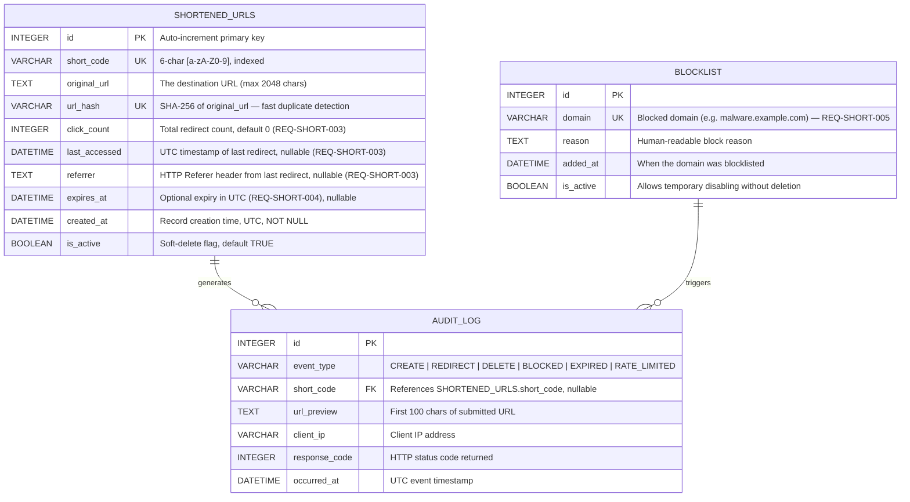

# Entity-Relationship Diagram — URL Shortener Data Model

> REQ references: REQ-SHORT-001, REQ-SHORT-002, REQ-SHORT-003, REQ-SHORT-004

## Field Design Notes

| Field | Design Decision |
|-------|----------------|
| `url_hash` | SHA-256 of normalized URL enables O(1) duplicate detection without full-text scan. Satisfies REQ-SHORT-005 idempotency. |
| `short_code` | 6-char base-62 = 62^6 ≈ 56 billion possible codes. Collision-resistant at any realistic scale. |
| `expires_at` | Evaluated at redirect time, not stored as a flag. This means expiry is always accurate to the clock without a background job. |
| `is_active` | Soft delete preserves audit trail while preventing redirects. |
| `referrer` | Stores only the last referrer for simplicity. Full referrer history would require a separate click_events table. |
