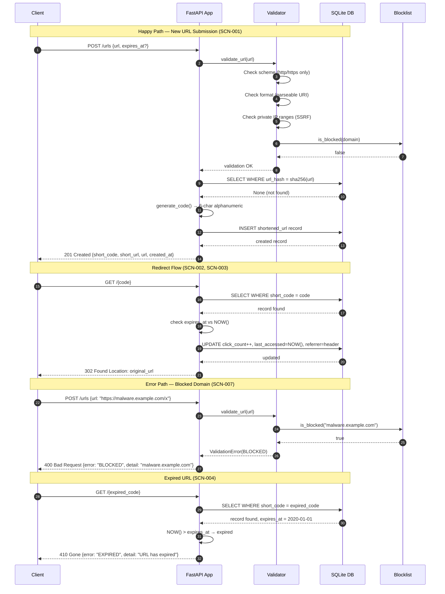

# Sequence Diagram — URL Shortening Flow

> REQ references: REQ-SHORT-001, REQ-SHORT-005, REQ-SHORT-006

```mermaid
sequenceDiagram
    autonumber
    participant C as Client
    participant API as FastAPI App
    participant V as Validator
    participant DB as SQLite DB
    participant BL as Blocklist

    Note over C,DB: Happy Path — New URL Submission (SCN-001)

    C->>API: POST /urls {url, expires_at?}
    API->>V: validate_url(url)
    V->>V: Check scheme (http/https only)
    V->>V: Check format (parseable URI)
    V->>V: Check private IP ranges (SSRF)
    V->>BL: is_blocked(domain)
    BL-->>V: false
    V-->>API: validation OK
    API->>DB: SELECT WHERE url_hash = sha256(url)
    DB-->>API: None (not found)
    API->>API: generate_code() → 6-char alphanumeric
    API->>DB: INSERT shortened_url record
    DB-->>API: created record
    API-->>C: 201 Created {short_code, short_url, url, created_at}

    Note over C,DB: Redirect Flow (SCN-002, SCN-003)

    C->>API: GET /{code}
    API->>DB: SELECT WHERE short_code = code
    DB-->>API: record found
    API->>API: check expires_at vs NOW()
    API->>DB: UPDATE click_count++, last_accessed=NOW(), referrer=header
    DB-->>API: updated
    API-->>C: 302 Found  Location: original_url

    Note over C,DB: Error Path — Blocked Domain (SCN-007)

    C->>API: POST /urls {url: "https://malware.example.com/x"}
    API->>V: validate_url(url)
    V->>BL: is_blocked("malware.example.com")
    BL-->>V: true
    V-->>API: ValidationError(BLOCKED)
    API-->>C: 400 Bad Request {error: "BLOCKED", detail: "malware.example.com"}

    Note over C,DB: Expired URL (SCN-004)

    C->>API: GET /{expired_code}
    API->>DB: SELECT WHERE short_code = expired_code
    DB-->>API: record found, expires_at = 2020-01-01
    API->>API: NOW() > expires_at → expired
    API-->>C: 410 Gone {error: "EXPIRED", detail: "URL has expired"}
```
