# State Diagram — URL Lifecycle

> REQ references: REQ-SHORT-001, REQ-SHORT-002, REQ-SHORT-004, REQ-SHORT-006

```mermaid
stateDiagram-v2
    [*] --> PENDING_VALIDATION : Client submits POST /urls

    PENDING_VALIDATION --> REJECTED : URL invalid / blocked / bad scheme
    REJECTED --> [*] : 400 or 422 returned to client

    PENDING_VALIDATION --> DUPLICATE_FOUND : url_hash match in DB
    DUPLICATE_FOUND --> ACTIVE : Return existing short_code (200 OK)

    PENDING_VALIDATION --> ACTIVE : Valid new URL — code generated, DB record created (201 Created)

    ACTIVE --> ACTIVE : GET /{code} within expiry window\nclick_count++, last_accessed updated\n302 redirect returned

    ACTIVE --> EXPIRED : GET /{code} after expires_at timestamp\n(evaluated at request time)\n410 Gone returned

    ACTIVE --> DELETED : DELETE /api/urls/{code}\nis_active = FALSE\n204 No Content returned

    EXPIRED --> DELETED : Admin/cleanup process\nor DELETE /api/urls/{code}

    DELETED --> [*] : Soft-deleted; record retained in DB\nfor audit log integrity

    note right of ACTIVE
        Healthy state.
        Responds to redirects.
        Analytics tracked.
        REQ-SHORT-002 ✓
        REQ-SHORT-003 ✓
    end note

    note right of EXPIRED
        expires_at < NOW().
        Redirects blocked (410).
        Analytics NOT incremented.
        REQ-SHORT-004 ✓
    end note

    note right of DELETED
        is_active = FALSE.
        Redirects → 404.
        Record preserved for audit.
        REQ-SHORT-006 ✓
    end note
```

## State Transition Table

| From State | Trigger | To State | HTTP Response |
|------------|---------|----------|---------------|
| — | POST /urls (valid, new) | ACTIVE | 201 Created |
| — | POST /urls (valid, duplicate) | ACTIVE | 200 OK |
| — | POST /urls (invalid/blocked) | REJECTED | 400 / 422 |
| ACTIVE | GET /{code}, not expired | ACTIVE | 302 Found |
| ACTIVE | GET /{code}, expires_at past | EXPIRED | 410 Gone |
| ACTIVE | DELETE /api/urls/{code} | DELETED | 204 No Content |
| EXPIRED | DELETE /api/urls/{code} | DELETED | 204 No Content |
| DELETED | GET /{code} | DELETED | 404 Not Found |
